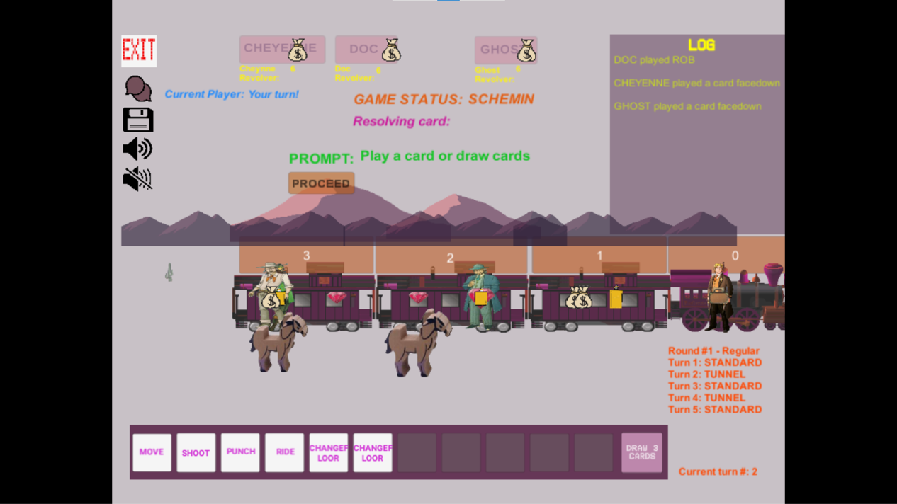

# Colt Express
This is an implementation of the board game [Colt Express](https://www.ludonaute.fr/portfolio/colt-express/?lang=en) as a Unity game.

# Description
This project was created and developed over a period of about eight months for the course *COMP-361 - Software Engineering Project* at [McGill University](https://www.mcgill.ca/).

# Download and Installation
Download the latest release by clicking [here](https://github.com/a-a-lohn/colt-express/releases/download/v1.0/ColtExpress.Setup.Windows.x86.-.64.exe) and follow the installer instructions.

Note: This release is only compatible for Windows machines. Furthermore, this application relies on two external server components running on localhost: a [Lobby Service](https://github.com/kartoffelquadrat/LobbyService) (LS) instance and a [SmartFoxServer](https://www.smartfoxserver.com/) (SFS) instance. Please see the [setup guide](setup.md) for more details.

# Usage
Once downloaded/installed (or built manually), the game can be run by clicking on the Colt Express Unity Application executable.
